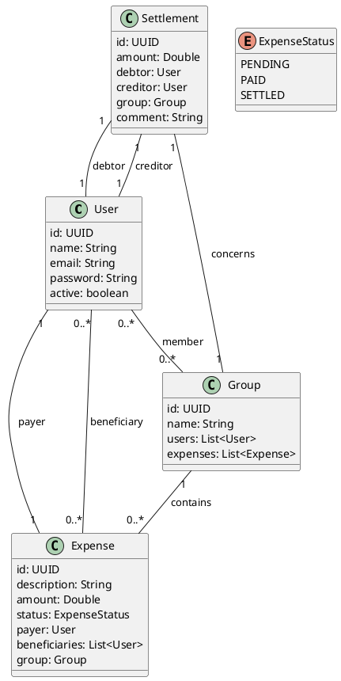

# Tricount API

Ce projet consiste à créer une API RESTful qui correspond à l'application tricount.

## Fonctionnalités

- Créer un groupe de dépenses
- Entrer des dépenses dans un groupe (Ex: `Billet de Train 25€ - Marc`, `Sac de pomme pour le pique nique 2.99€ - Hamza`)
- Consulter la liste et le total des dépenses, filtrer par personnes et montant (supérieur/inférieur à...)
- Pouvoir consulter le compte indiquant le total des dépenses et qui doit combien à qui, et pouvoir indiquer qu'on a payé son dû
- S'authentifier pour pouvoir voir les différents groupes dont on fait parti

## Réalisation

- Commencer par créer un diagramme d'entité
- Initialiser un projet Spring Boot avec les dépendances nécessaires
- Faire une architecture Controller -> Business -> Repository avec des DTO dans les contrôleurs, toute la logique et l'accès aux repositories dans le Business
- Faire des tests fonctionnels pour quelques endpoints

## TODO

- [x] Créer un diagramme d'entité
- [x] Générer les entités à partir du diagramme
- [ ] Créer les repositories pour les entités
- [ ] Créer les services pour la logique métier
- [ ] Créer les contrôleurs pour l'API REST
- [ ] Ajouter la sécurité pour l'authentification des utilisateurs
- [ ] Initialiser un projet Spring Boot avec les dépendances nécessaires
- [ ] Faire une architecture Controller -> Business -> Repository avec des DTO dans les contrôleurs, toute la logique et l'accès aux repositories dans le Business
- [ ] Faire des tests fonctionnels pour quelques endpoints

## DIAGRAMME

---

> Généré avec le script GitHub Repository Creator
